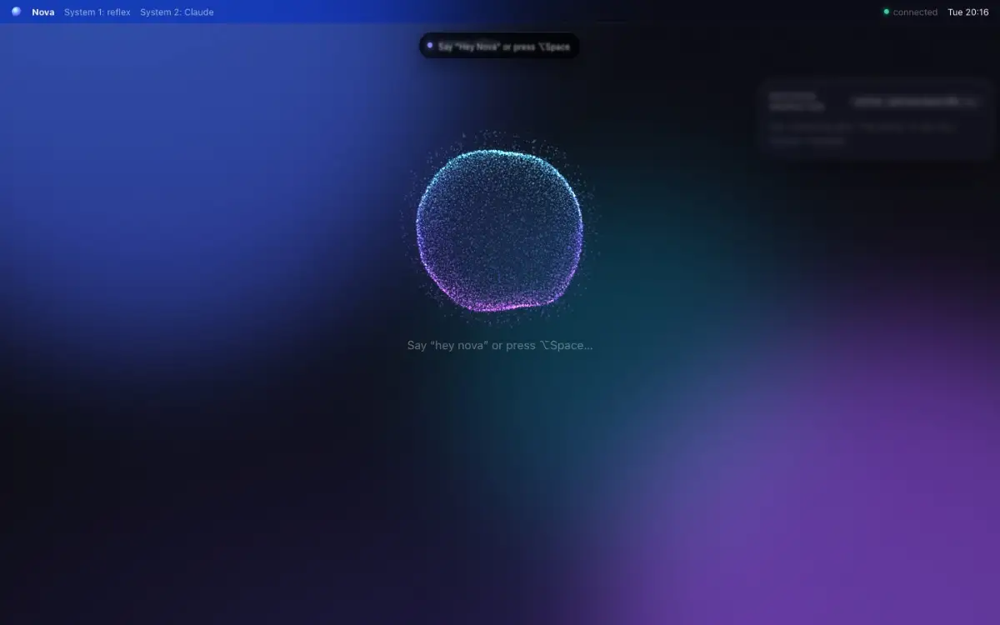
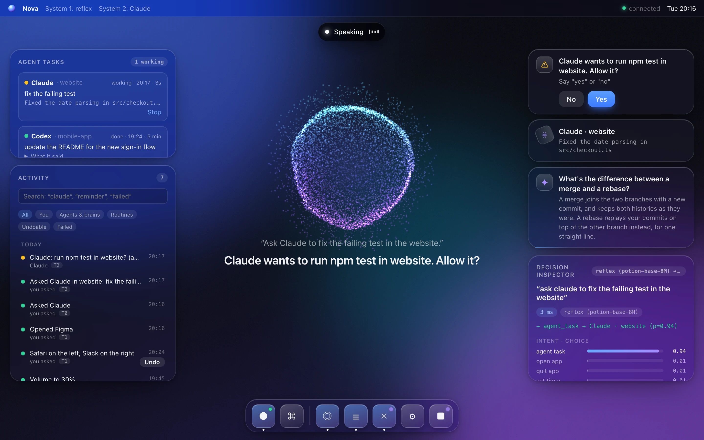
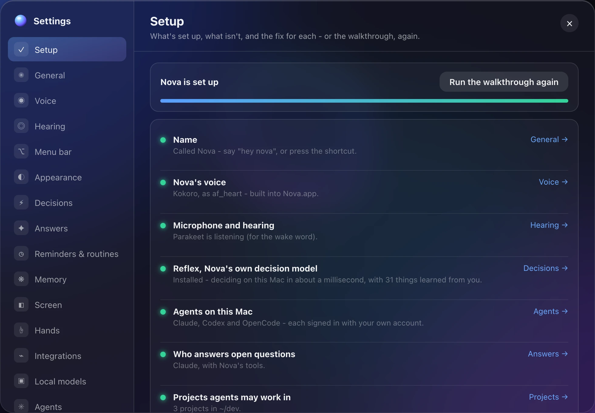
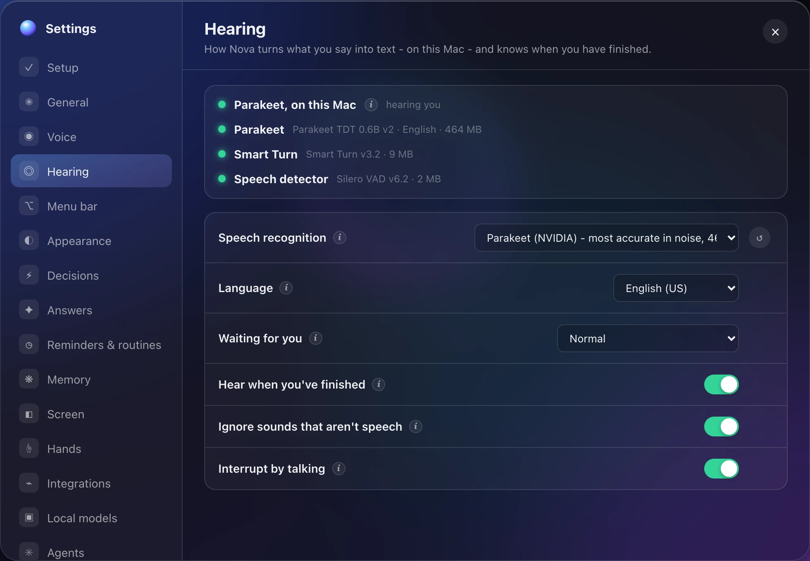
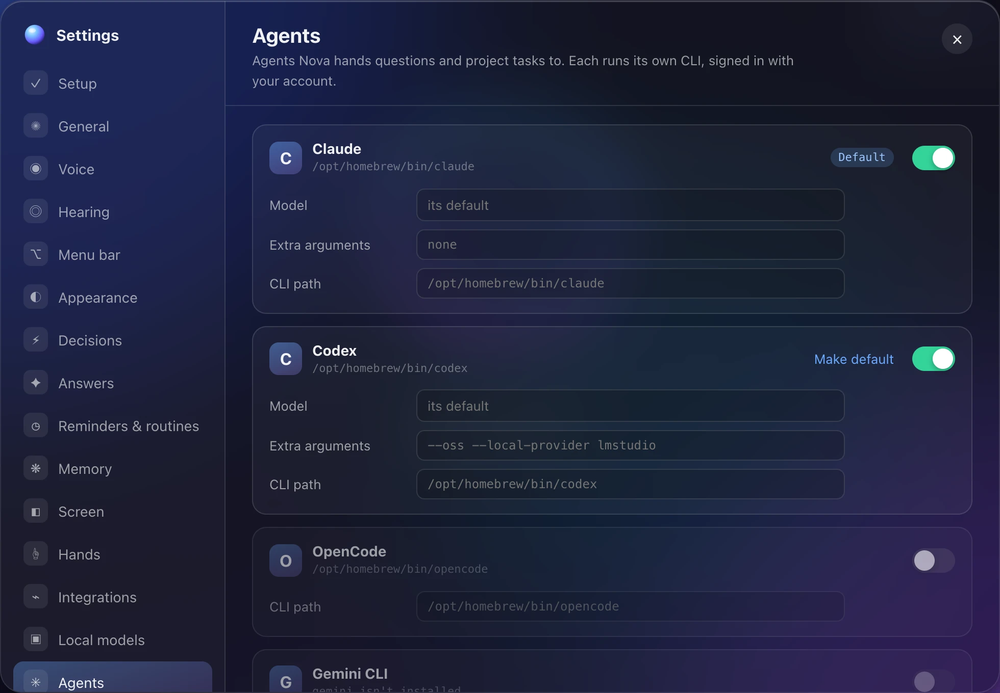
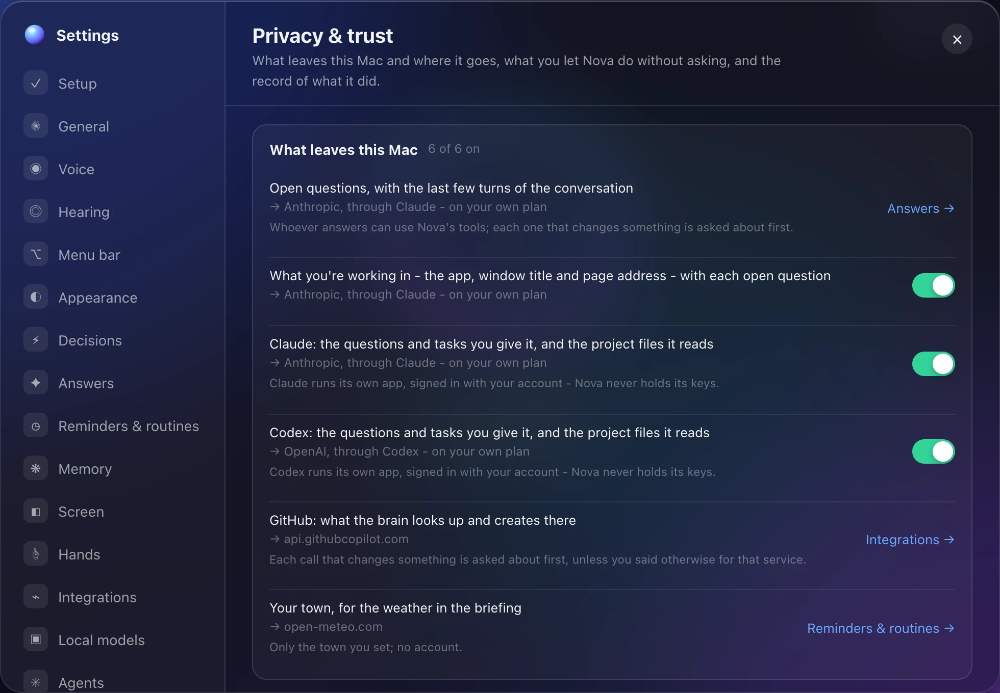
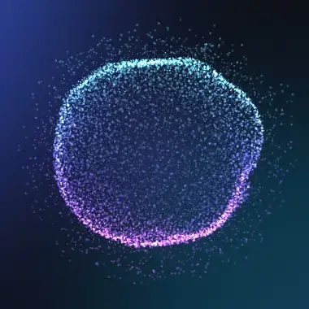

# Nova

A voice-first, model-agnostic agentic OS layer. You talk; it acts.

<p align="center">
  
</p>

- **System 1 - fast decisions.** Every utterance gets one typed decision call (intent, target app, "was that meant for me?") through a swappable `DecisionEngine`. Default: **Reflex**, Nova's own model, on your Mac in about a millisecond. Or **Jev**, TypeSafe's System One model, called directly with your own key. Also: a model on your own server, or an offline keyword matcher.
- **System 2 - reasoning.** Open questions go to any model you plug in (Claude, GPT, Gemini, local).
- **Paired agents.** Claude Code, Codex, OpenCode, Gemini CLI or any agent CLI answer questions and do project
  tasks in the background - narrated live, with risky steps asked out loud.
- **Glass UI.** macOS-inspired shell: the Orb, Live Pill, frosted cards, magnifying dock, Decision Inspector.

Design docs and decisions are in `doc/` as PDFs.

## A look around

The window, with Activity (⌘J) and the task board (⌘U) open: what Nova did and who asked, the agents' tasks, Claude's
question waiting for a yes, and the Decision Inspector (⌘I) - how System 1 read the last thing said, with its
probabilities.



<table>
  <tr>
    <td width="50%"><br><sub><b>Setup</b> - each part of Nova, where it stands, and the fix for what isn't there yet</sub></td>
    <td width="50%"><br><sub><b>Hearing</b> - speech turned into text on the Mac, and the models that do it</sub></td>
  </tr>
  <tr>
    <td width="50%"><br><sub><b>Agents</b> - each vendor's own CLI, signed in with your account</sub></td>
    <td width="50%"><br><sub><b>Privacy &amp; trust</b> - what leaves the Mac, where it goes, and a switch for each</sub></td>
  </tr>
</table>

<p align="center">
  
  <br><sub>The Orb (<code>ParticleOrb.tsx</code>): listening to a voice, thinking while Claude answers, then speaking.</sub>
</p>

All of these come from the window's scripted session (`#demo`, in `apps/desktop/src/lib/demo.ts`), with made-up
settings - nothing from anyone's Mac. After a change to the window, `npm run readme:media` takes them all again in
headless Chrome (it needs Google Chrome, and `brew install webp` for the animations).

## Layout

```
packages/core     brain: DecisionEngine (Jev / LLM / heuristic), NovaBrain orchestrator, skills, guardian, protocol
apps/daemon       local service: WebSocket API on 127.0.0.1:7878, macOS app control, agent pairing, jev:ping latency spike
apps/desktop      React + Vite glass UI (runs in a browser, or inside Nova.app)
apps/desktop/macos  Nova.app: Nova in the menu bar - its microphone and speaker, the ⌥Space shortcut, the floating orb
apps/ios          Nova on the iPhone (SwiftUI): the same Nova, reached through the daemon's door for paired phones
```

One core, many shells: the desktop app, a web app and future IDE extensions are all thin clients of the daemon.

## Run it

Requires Node 22+; Nova.app and the Mac helpers need Xcode (or its Command Line Tools) for Swift.

```bash
npm install
npm run dev                   # daemon + UI
```

No `.env` needed: it only holds constants, such as Jev's key if you use Jev (see `.env.example`). Everything else is a setting.

Open **http://localhost:5173** in Safari, Chrome or Edge (any browser with the Web Speech API) and allow the
microphone - Nova starts listening on its own. Then say:

- "Hey Nova, open Slack"
- "Nova, what time is it?"
- "Nova, set a timer for 5 minutes"
- "Nova, quit Spotify" → "yes"  (tier-2 action: spoken confirmation)
- "Hey Nova" … pause … "open Figma"  (after the wake word or a reply, Nova listens 30 s without it)

Voice setup, once per browser:
- **Stop the permission prompt:** Safari → Settings → Websites → Microphone → `localhost` → **Allow**.
  Chrome/Edge: allow the microphone on every visit (the icon at the left of the address bar).
- **Safari** also needs Dictation on for speech recognition: System Settings → Keyboard → Dictation.
- Browsers only play sound after one click or key press per visit, so click anywhere once to hear replies (Nova shows a
  reminder when a reply is waiting for that click). Safari can skip it: Settings → Websites → Auto-Play → `localhost` → Allow All Auto-Play.
- **Stop listening:** click the microphone in the dock or say "stop listening" - the microphone is released, not just
  muted, and stays off until you click it again. Typing (⌘K) still works while it's off.

Wake word: Settings → Voice sets how long Nova listens without it after replying (30 s by default), or drops it
entirely (conversation mode) - Nova's "was that for me?" check then filters background speech, which works best
with Jev or local-model decisions rather than the keyword matcher.

Press **⌘K** to type instead, **⌘I** for the Decision Inspector, **⌘J** for Activity, **Esc** to stop.
`http://localhost:5173/#demo` plays a scripted session with no daemon, made-up settings included, for design work.

For Nova in the menu bar - always there, no browser tab - build **Nova.app** with `npm run app` (below).

## Settings

Click ⚙ in the dock or say "open settings" (⌘, works in the native window; browsers keep it for their own settings).
Everything is configurable there and applies immediately, without a restart. What a setting does is behind the ⓘ
beside its name - point at it, or click it to keep it open:

- **Setup** - what's set up and what isn't, with the fix for each, and the first-run walkthrough again.
- **General** - the assistant's name. It answers to "hey <name>", "okay <name>" and the name, unless you set your own wake words.
- **Voice** - Kokoro's voices (Nova's voice, inside Nova.app), wake words, conversation mode, how long it keeps listening after replies, listening on open and speaking rate.
- **Hearing** - how Nova turns speech into text: Apple's on-device recognizer, Parakeet, or the browser's own; the language; how long it waits when you pause; Smart Turn; talking over Nova.
- **Appearance** - the Orb: a sphere of thousands of moving dots drawn by the GPU (or the classic glass orb), its colours and how much it moves. It breathes when idle, ripples with your voice, swirls while thinking and moves with its voice as it speaks. Both orbs - the one in the window and the floating one - resize by hand: pinch one, hold ⌥ and scroll over it, or drag the handle that shows when you point at it (or its arrow keys, in the window); Settings → Appearance has a slider for each. The text - what you said and the replies, in the window and the floating orb - has its own size: the slider there, ⌘+ / ⌘− / ⌘0 in the window as in a browser, or by voice ("make the text bigger", "text size 150 percent", "back to normal" - and "undo" puts it back). A reply's cards close by themselves after a few seconds (8, or as set there - pointing at one holds it); questions, running timers and agents' tasks stay until they're done. At its largest, the window's Orb sits in the middle of the window.
- **Decisions / Answers** - the decision engine, and who answers open questions: automatically your default paired agent, or any agent, local model or cloud model.
- **Integrations** - services the brains can use through Nova (Notion, Linear, GitHub, ...): sign-in, and when Nova asks you first.
- **Local models** - LM Studio, Ollama, oMLX, mlx_lm, llama.cpp and any server you add: whether it's running, which models it offers, keys.
- **Agents** - which are paired, the default, and each one's model, extra arguments and CLI path, plus your own agent CLIs.
- **Projects** - the folders agents may work in.
- **iPhone** - pair your iPhone, whether it may connect, and where what you say into it is heard.
- **Privacy & trust** - what leaves the Mac and where it goes (a switch for each), what Nova may do without asking (revoke any), how long the record of actions is kept, and snapshots for undoing agents' changes.

Your settings live in `~/.nova/settings.json`: plain JSON holding only what you've changed, so it's also fine to edit by
hand - Nova applies the file as soon as you save it. Anything it can't use falls back to its default, and Settings says why.
The keys, defaults and allowed values are defined in `packages/core/src/settings.ts`.

```json
{
  "name": "Jarvis",
  "voice": { "followUpSeconds": 20, "speaker": "Samantha" },
  "answers": { "model": "claude" },
  "models": { "servers": { "omlx": { "url": "http://localhost:8000/v1" } } },
  "agents": { "enabled": ["claude", "codex"], "options": { "codex": { "args": "--oss --local-provider lmstudio" } } },
  "projects": { "named": { "site": "~/work/site" } }
}
```

`.env` holds only constants: API keys (`NOVA_JEV_API_KEY`, `NOVA_<SERVER>_API_KEY`), the port (`NOVA_PORT`), the windows
allowed to change settings (`NOVA_UI_ORIGINS`) and file locations (`NOVA_SETTINGS_FILE`, `NOVA_AGENTS_FILE`); changing it
needs a restart. Settings shows whether each key is set, never its value, and only Nova's own window (or a program on your
Mac) can change settings. Settings kept in `.env` by earlier versions (`NOVA_NAME`, `NOVA_BRAIN_MODEL`, ...) are moved into
the settings file once and ignored after that; the daemon lists the ones you can delete.

## Nova's voice (Kokoro)

Nova speaks with [Kokoro](https://huggingface.co/onnx-community/Kokoro-82M-v1.0-ONNX) (Apache-2.0), a small neural voice
that sounds close to a real person and runs on your Mac: free, private, and quick enough to start within a moment of the
reply. It's Nova's only voice, and it comes inside Nova.app - `npm run app` puts it in the app (from `~/.nova/models`
when it's already there, as an APFS clone that takes no extra space; otherwise it's fetched once, checked against its
pinned checksums, while the app is built). There's nothing to download in Nova itself.

The daemon speaks each reply sentence by sentence and streams the audio to Nova.app (or every window), so talking starts
after the first sentence, and the Orb moves with how loud the voice actually is. Pick a voice in Settings → Voice
(Heart, Bella, Michael, Emma, George, ...) and press Preview. Without Kokoro - running only the web window, without
Nova.app - replies are shown, not spoken; `npm run voice:download` puts Kokoro in `~/.nova/models` for that case.

## Hearing on your Mac

Nova hears you on the Mac itself: the window streams its microphone (with echo cancellation) to the daemon, which turns
speech into text and decides when you've finished. Nothing you say leaves the Mac. Choose the engine in Settings → Hearing:

- **Apple's on-device recognizer** (the default on macOS 26 and later): live text as you speak, a vocabulary of your app,
  agent and project names, and nothing to download - it uses the language models macOS already has. Nova never downloads
  one behind your back: for a language whose model isn't on the Mac, turn on Dictation for it in System Settings.
- **Parakeet** ([NVIDIA Parakeet TDT 0.6B v2](https://huggingface.co/FluidInference/parakeet-tdt-0.6b-v2-coreml),
  CC-BY-4.0) on the Neural Engine: the most accurate in a noisy room, with a draft of your words every ¾ second. English.
- **The browser's speech recognition**: the fallback, used automatically while on-device hearing starts or if it can't.

```bash
npm run hearing:download      # Parakeet (464 MB), Smart Turn (9 MB) and the speech detector (2 MB) - or Settings → Hearing → Install
npm run hearing:build         # the hearing helper; Nova also builds it by itself the first time (a few minutes)
```

When you pause, Nova waits a moment if your words sound complete and longer if you trail off ("in my current project I
want to…"). [Smart Turn](https://huggingface.co/pipecat-ai/smart-turn-v3) (BSD-2) listens to your tone as well, so it can
tell a finished sentence from a thinking pause in about 30 ms. You can talk over Nova to stop it mid-sentence - a stop
word or a couple of words of your own do it - and Nova never mistakes its own voice for yours. Settings → Hearing sets how
patient it is, and turns Smart Turn and talking over Nova on or off.

The recognizers run in a small Swift helper (`apps/daemon/native/hearing`), built on this Mac with Xcode's Swift. Parakeet
runs through [FluidAudio](https://github.com/FluidInference/FluidAudio) (Apache-2.0), fetched at a pinned commit and built
without its optional prebuilt text-normalization binary, which hearing doesn't need. Models download from pinned revisions
and are checked against their checksums, into `~/.nova/models`.

## Voice ID: only your voice

With Voice ID on, Nova listens to you alone. Other voices are ignored entirely - a TV, a video call, someone in the
room - even when they say its name, and nothing they say opens its listening window or is kept. Set it up in
Settings → Voice → **Voice ID**:

1. **Install** the model (WeSpeaker v2, 8 MB, from a pinned revision, checked file by file).
2. **Set up** - about 45 seconds of your voice, the ways Nova will hear it: six phrases as usual, two a step back
   from the microphone, two quietly, and a quarter of a minute of talking freely. Each recording is checked before it's
   taken - loud enough, not distorted, clear of the room's noise, long enough in actual speech, and a voice (its pitch is
   found in code) - with a live meter while you speak, and a ✓ or why to say it again beside each. Then a check: new
   phrases must come out as you, three in a row (each one that doesn't is learned from, up to seven), before Voice ID
   switches itself on. It keeps a voiceprint for each way you were heard, and a turn is you by the closest of them.
3. **Test my voice**: say anything, and the panel shows whose voice it sounded like - *That's you*, *Not you* or
   *Can't tell* (and why) - how closely it matched, on a bar marked with the two thresholds, and what Nova would have
   done. Have someone else talk, or play a video, to see it tell them apart. While a test runs, nothing said is acted
   on or learned from; it ends with **Done**, or by itself after a quiet minute. It works with Voice ID switched off,
   too.

How it works: each finished turn's audio goes, on this Mac, to the hearing helper, which turns it into a voiceprint
(256 numbers) on the Neural Engine; the daemon compares it with yours (`apps/daemon/src/hearing/voiceid.ts`). Well
above your bar, it's you; well below, it isn't - ignored; in between, or a turn too short to tell (a quick "yes"), Nova
says it couldn't tell and does nothing: **hold the talk shortcut and say it again** - whoever holds the key is at this
Mac, so it counts as you, as typing does. Talking over Nova stops it only in your voice. A short reply right after you've spoken ("yes") counts as you - for 20 seconds after a turn that was clearly yours, unless it clearly isn't you. The bars come from how alike your setup phrases are one against the others (a turn said another time scores somewhat lower than a phrase against an average that includes it), and every turn's decision is written to `~/.nova/logs/daemon.log` as `[voice-id] you 0.71 · 2.4 s · heard by Nova.app`, so a miss can be looked into. Turns that were clearly you,
and long enough, refine your voiceprint a little (Settings → Voice → *Keep learning your voice*), so a cold or another
microphone still works - and so do turns you say with the talk shortcut, and one Nova couldn't place that you then
said again with it. **Improve my voice** adds a few more phrases (as usual, a step back, talking) to what it learned
before, without setting up again.

Your voiceprint lives in `~/.nova/voiceprint.json` (readable by you alone) and never leaves the Mac; **Forget my
voice** deletes it. Voice ID needs on-device hearing (Nova.app, or a window streaming its microphone): speech a
browser recognises itself never reaches it, so with Voice ID on it doesn't count as you.
`nova-hearing --voice-selftest ~/.nova/models/wespeaker-v2` checks the model with two of macOS's own voices.

**The master keyword** (Settings → Voice → Voice ID): a phrase of two words or more that you type once - only a salted
hash of it is kept, on this Mac. Said in any voice, anywhere in a sentence ("Manuel, *your keyword*, open Safari"),
it turns Voice ID off until you turn it back on there - for a guest, or a day Nova doesn't know your voice - and what
followed it goes through. Nova says so aloud, sends a notification and puts it in Activity. Meanwhile any voice is
heard, but held back: nothing it asks deletes (files to the Trash, memories, reminders, undo), spends or clicks
anything weighty, and "yes, always" from it counts once, never for good. Typing, and holding the talk shortcut, are
you as ever.

## Integrations

Every brain - Claude, Codex, OpenCode, a local model - can use your services through Nova: Settings → Integrations,
pick one, and it's offered to all of them. Each is an MCP server, hosted or started on your Mac:

- **Sign in with the browser**: Notion, Linear, Jira & Confluence, Sentry, Supabase, Vercel, Figma. Nova registers itself
  with the service and opens its sign-in page; you sign in yourself, and Nova keeps only the access it was given (in
  `~/.nova/integration-tokens.json`, readable by you alone). Sign out any time.
- **Your own token**: GitHub (a personal access token) and Stripe (a restricted key). Put it in `.env` - for example
  `NOVA_GITHUB_TOKEN=...` - and the settings only name it (`Bearer ${NOVA_GITHUB_TOKEN}`); press Retry to pick it up.
- **No sign-in**: Hugging Face and Cloudflare's docs.
- **Anything else**: any MCP server's address, or the command that starts one on your Mac (`npx -y some-mcp-server`).
  Local servers get a clean environment - Nova's own keys never reach them.

Nova asks you out loud before each action a brain takes through a service ("Codex wants to use Linear: create issue 'Fix
the login bug'. Allow it?"), unless you say otherwise: per service, *only before changes* (tools the service itself
labels read-only run without asking) or *never*, and per tool, *allow*, *ask first* or *block* (a blocked tool is kept
from the brains entirely). Paired agents that stay running are refreshed between questions when a service's tools change.

## Nova in the menu bar (Nova.app)

```bash
npm run app        # builds the window and Nova.app on this Mac, puts it in ~/Applications and opens it
```

Nova.app makes Nova part of the Mac rather than a page:

- **It listens for its name from anywhere**, with no window open. The microphone runs through Apple's voice
  processing and Nova's replies play through the same audio engine, so its echo canceller takes Nova's own voice out
  of what the microphone hears - you can talk over Nova. macOS shows its orange dot while it listens; it pauses while
  the Mac is locked or asleep, and **Mute the Microphone** in its menu turns it off until you turn it back on (saying
  "stop listening" does the same). What it hears is turned into text on the Mac, as before.
- **⌥Space** (Settings → Menu bar → Shortcut): hold it while you talk and let go when you're done, or tap it and just
  talk; tap it again to stop listening. Pressing it while Nova speaks cuts Nova off. It needs no permission, and it
  works even while the microphone is muted.
- **The orb** floats in a corner of the screen with what Nova hears and says, then shrinks to the orb while Nova keeps
  listening, then goes. It never takes focus from the app you're in, and it stays out of screenshots and screen
  shares. Click it for the full window (Settings included).
- **It opens at login and runs the daemon** - or uses one that's already running, such as `npm run dev` in a
  terminal. While you work on Nova itself, set Settings → Menu bar → *Who runs Nova's daemon* to the terminal (but
  see below: a daemon of the terminal's gets no screen or hands). Its daemon writes to `~/.nova/logs/daemon.log`;
  the app's own log is `log show --predicate 'subsystem == "dev.nova.app"'`.

While Nova.app runs, a browser window of Nova shows what happens but doesn't listen or speak itself. The first time,
macOS asks whether Nova may use the microphone. `apps/desktop/macos/.build/release/Nova --selftest` checks the parts
that need no microphone.

### Signing: permissions that survive rebuilds

Nova's apps - Nova.app, Nova Eyes and the hearing helper - are built and signed on your Mac (`apps/daemon/src/shell/signing.ts`).
With an Apple certificate of yours they're signed with it, and macOS keys what you allowed them (the microphone, the
screen, Accessibility, controlling other apps) to each app's id and your team: every rebuild, and next year's renewed
certificate, still meets that - and no one else's app can. Signed "for this Mac alone" (ad hoc) instead, macOS asks
again after every rebuild.

- **Getting a certificate**: sign in to Xcode with your Apple ID (Xcode → Settings → Accounts); it makes a free
  Apple Development certificate. Nova finds it by itself (a Developer ID one comes first), or name one in `.env` as
  `NOVA_SIGN_IDENTITY` (its name, or `-` for ad hoc); `security find-identity -v -p codesigning` lists yours.
  Then `npm run app` - macOS asks for each permission one last time; Nova Eyes and the hearing helper are signed
  again by themselves the next time they're needed.
- **Hardened**: all three run with the hardened runtime, so nothing can be injected into them to borrow their
  permissions, and each may use only what it declares (`apps/desktop/macos/Nova.entitlements`: the microphone,
  Calendar and Reminders, controlling other apps; `apps/daemon/native/eyes/Eyes.entitlements`: reading the browser's
  address).
- **Nova Eyes answers only Nova.app's daemon**: signed with your certificate, it checks - by code signature, not by
  name - that the daemon asking was started by your Nova.app, and refuses anything else (Settings → Hands says so).
  So a daemon you run in a terminal (`npm run dev`) gets no screen or hands: let Nova.app run it (it runs this
  folder's code; restart it from its menu after a change).
- Settings → System shows who signed each app and until when, and the setup checklist says when your certificate is
  about to run out.

## Nova on your iPhone

The same Nova in your pocket. What you say into the iPhone is heard and answered by Nova on your Mac - its hearing,
Reflex, your agents, Nova's hands - and the reply is spoken on the phone, in Kokoro's voice.

```bash
npm run phone                 # build Nova for your iPhone and put it on it (paired with this Mac, Developer Mode on)
npm run phone -- --simulator  # or in the iOS Simulator
```

1. On the Mac: Settings → iPhone → **Let your iPhone connect**, then **Pair an iPhone**.
2. On the iPhone: open Nova and scan the code. (In the Simulator: **Copy the link**, then `xcrun simctl openurl booted "<the link>"`.)
3. Hold the talk button and talk - or tap it, talk, and tap it again. The keyboard button types instead, and ■ stops
   everything. Nova's cards show on the phone - a question waiting for a yes is answered right there - and ✳︎ is the
   agents' task board, with Stop and Run again.

- **Only your phone gets in.** The door - on your Wi-Fi, port 7879 (`NOVA_PHONE_PORT`) - is open only while *Let your
  iPhone connect* is on. Every connection is encrypted (TLS), and the phone accepts only the certificate the pairing
  code named. Each phone proves who it is by signing a challenge with a key its Secure Enclave keeps. A pairing code
  works once, for ten minutes, and five wrong guesses end it. Forget a phone in Settings → iPhone and it's cut off at once.
- **Heard on the Mac, or on the iPhone.** While you hold the button the phone streams its microphone to the Mac, and
  Nova hears it as it hears you at the Mac. On a weak connection - or when Settings → iPhone says so - Apple's
  recognizer on the iPhone does it, and only the text goes to the Mac (its speech model downloads once, from the
  app's Mac page).
- **Siri, Shortcuts and the Action button.** "Hey Siri, ask Nova" - then say what you want - reaches Nova on your Mac
  without opening the app: the answer shows on screen and is said in Nova's own voice on the phone, never Siri's.
  "Hey Siri, talk to Nova" opens Nova listening, and so can the Action button (Settings → Action Button → Controls →
  **Talk to Nova**). **Nova's Briefing**, **What Nova's Agents Are Doing**, **Nova's Reminders** and **Stop Nova** are
  there too - by voice, in Spotlight and in the Shortcuts app, where **Ask Nova** hands its answer to the next step.
  When Nova asks something back it opens and listens for your answer, and for what only a tap allows it shows **Allow
  with Face ID**. A locked phone asks for Face ID first: no one talks to your Mac through your phone but you.
- **Widgets and Control Center.** Nova's widget - on the Home Screen, the Lock Screen and in StandBy - shows the
  reminders coming up (a timer counts down) and what your agents are doing, and a tap talks to Nova (on the big one,
  the rest opens the agents' task board). **Talk to Nova** is a control too, for Control Center, the Lock Screen and
  the Action button. The widget shows what Nova on the phone last heard from the Mac: it can't reach the Mac itself.
- **Agents on the Lock Screen.** While an agent works on a task, it's a Live Activity on the Lock Screen and in the
  Dynamic Island: the task, its latest step and how long it's been at it, with **Stop** - and what it found once it's
  done. The time counts on by itself; with no push on a free account, the step is as fresh as Nova on the phone's last
  word from the Mac (while it's open, when Siri asks, when it checks in - sooner while an agent works), and it says how
  old that is once it's gone quiet. A task gets its activity once Nova has been in front since it started - iOS's rule.
  Settings → iPhone → *Agents on your Lock Screen* turns them off.
- **Nova speaking, in the Dynamic Island.** Leave Nova while it's answering you - for the Home Screen, another app or
  the Lock Screen - and the answer stays with you in the Dynamic Island: an ellipsis while Nova thinks, then bars that
  move with its voice, as music's do. Hold the island for what it's saying and **Stop**, which ends that answer
  (agents go on); it's gone as soon as Nova is done. Settings → iPhone → *Nova speaking, in the Dynamic Island* turns
  it off.
- **News where you are.** While you're away from the Mac (it's locked, or untouched a while) and Nova is open on the
  phone, reminders coming up and agents finishing are said there - and what Nova held comes up when you open it, or,
  with Nova closed, as a notification when the phone next checks in (Settings → iPhone → *News on your iPhone*). What
  the phone showed isn't said again when you're back at the Mac.
- **Reminders ring on the phone.** Your reminders and timers are the iPhone's own notifications too, so they ring even
  with Nova closed, with Snooze and Done that reach the Mac (*Reminders on your iPhone*).
- **Face ID for what can't be taken back.** What only a tap allows - paying through a service, cancelling every
  reminder at once - shows **Allow with Face ID** on the phone, and nothing happens until Face ID (or the passcode) says
  it's you. A spoken "yes" never does it, and "no" still refuses.
- **What a phone may do.** Talk and type to Nova, answer its questions, stop it, and stop or rerun agents' tasks -
  with the same rules and permissions as at the Mac. It can't change Settings, and it never sees your memories or the
  record of actions. Replies to what you said on the phone are spoken there.
- **Checking in by itself.** With a free Apple account the Mac can't wake the phone with a push, so the phone checks
  in when iOS lets it (Background App Refresh - iOS decides when, by how you use the phone, from every so often to a
  few times a day): reminders set at the Mac since then will ring on it, the widget is brought up to date, and news
  that waited for you shows as a notification. Otherwise it hears from Nova while it's open, and when Siri or a
  shortcut asks something. Out of the front with nothing to do, it lets its connection go.
- **For now:** on the same Wi-Fi as the Mac - Tailscale, for anywhere, comes next. With a free Apple account, Xcode's
  signing lasts 7 days: run `npm run phone` again after that.

## Reminders, briefings and routines

Nova speaks up by itself now - at the right moment:

- **Reminders**: "remind me to call mum at 5", "remind me tomorrow morning about the dentist", "every weekday at 9
  remind me to stand up", "in 20 minutes remind me to check the oven". They're kept in `~/.nova/reminders.json`, so
  they outlast a restart (one due while Nova was off comes up late, and says so). When one comes up: "snooze" (or
  "remind me again in an hour"), "mark it done". Ask "what are my reminders today?", or "cancel the reminder to call
  mum" (Nova checks which first). Times are read in code - "at 9" in the afternoon means 9 PM, "at 1" means 1 PM.
- **The Reminders app**: say "in my Reminders" - or choose *every reminder* in Settings - and it goes there too, so it
  reaches your iPhone ("add milk to my Reminders" works without a time). Nova speaks the app's own reminders when
  they're due as well. This goes through Nova.app, which asks for access to Reminders the first time.
- **When you're free**: reminders, finished agent tasks and the briefing always show in the orb and as a notification
  (with Snooze and Done). Nova says them only when it's a good moment: not while a camera is on or your calendar
  says you're in a meeting, not in the middle of answering you - and while you're away (the Mac locked, or no typing
  or clicking for 10 minutes) it waits, then tells you "while you were away…" when you're back. Ask "what did I miss?"
  any time. Settings → Reminders & routines can make it never speak unasked, or always.
- **The morning briefing**: the first time you unlock the Mac each morning (or at a time you set, or only when you
  say "brief me" or "good morning"): the day, the weather, what's on your calendar, today's reminders, and what the
  agents did overnight. The weather comes from [Open-Meteo](https://open-meteo.com) (free, no key; only the town you
  set leaves the Mac), the calendar through Nova.app. With a brain paired, it also looks in the services you've
  connected (Linear, GitHub, Notion…) for anything that needs you today.
- **Routines**: "when I say start work, open Slack and brief me", "every weekday at 9, open Linear and brief me" - by
  voice or in Settings → Reminders & routines. Each step is something you'd say; one that needs a yes still asks, and
  the routine carries on after. Routines live in the settings file (`routines`).
- **Agents report back**: every task you give an agent is on the task board (the ✳︎ in the dock, ⌘U) - what it's doing
  now, what it said when it finished, why it failed - with Stop and Run again; kept in `~/.nova/tasks.json`. Ask "what
  are the agents doing?" or "what did Claude say?". Results are told at a good moment, like everything above.
- **The current project**: say "I'm working on the website", or just work in it - Nova notices the project in the
  window you're in - and "ask Claude to fix the tests" goes there without "which project?". Nova still asks before an
  agent starts.

## Trust: undo, "yes, always", the record, privacy

Nova does what you tell it - and it can take things back, remember what you let it do, and show you everything it
did:

- **Doing what you say**: when you tell Nova to do something - "quit Spotify", "click the Apple TV widget", "run my
  log water shortcut", "move the invoice to documents" - it does it, once it's sure what you said (a command it may
  have misheard is asked again, never acted on). It still asks before what you didn't ask for (a brain's own idea,
  an agent's commands), before a click that spends or moves money or can't be taken back ("Place order", "Pay",
  "Delete account") - text on a page can only ever add such a question. Paying through a service, and cancelling every
  reminder at once, need a tap, never a spoken yes: **Allow** on the question's card in Nova's window, or **Allow with
  Face ID** on your paired iPhone (its passcode if Face ID can't tell). To have Nova ask before every change instead:
  Settings → Privacy & trust → *Ask before doing what you asked for*.
- **Undo**: "undo that" (or the Undo in the Activity panel, ⌘J) takes back the last thing Nova did: a reminder or
  timer, something it remembered or forgot, a routine, an app it opened (it quits again) or quit (it opens again), the
  project you were on. "Undo what Claude did" takes back that agent's last action. Something from more than an hour
  ago is asked about first.
- **Agents' changes, undone**: before an agent works in a git project, Nova snapshots the project's files - as a git
  tree, with its own index, so your staging, branches and history are never touched (kept under
  `refs/nova/snapshots`). "Undo that" after "Claude finished in Agentic_OS" puts back exactly the files Claude
  changed - created files go, deleted ones come back - after asking. If you've edited any of those files since, it
  refuses rather than overwrite your work. Projects that aren't git repositories can't be undone this way (Settings →
  Setup says which). Turn it off in Settings → Privacy & trust.
- **"Yes, always"**: answer one of Nova's questions with "yes, always" (or "yes, for today") and it remembers exactly
  that one thing - quitting Spotify, Claude running `npm test` in Agentic_OS, a service's one tool - and won't ask
  about it again. Never for deleting things or risky commands (`rm`, `sudo`, force-pushes, piping a download into a
  shell). Only ever from your own words; each is listed in Settings → Privacy & trust to revoke, and kept in the
  settings file (`trust.rules`). Ask "what have I allowed you to do?".
- **The record of actions**: everything Nova did, who asked (you, a brain, an agent, a routine), the risk tier and how
  it went - one file a day in `~/.nova/activity` (readable only by you), kept a month by default. The Activity panel
  filters and searches it; ask "what did you do today?", "what did you do this week?", "what did Claude change?".
- **Stop everything**: say "stop everything" - or press ⌃⌥⌘. anywhere (Nova.app), or the ■ in the dock - and Nova
  stops the agents' tasks, withdraws its questions, stops speaking and mutes the microphone.
- **Privacy**: Settings → Privacy & trust lists everything that leaves the Mac and where it goes - the brain, each
  agent, each service, the weather - worked out from your settings as they are, with a switch for each; and what stays
  (hearing, the voice, Reflex, memories, the record).
- **Setting up**: the first time, a walkthrough goes through the name and voice, a hearing check, Reflex, the agents
  found on the Mac, projects, Nova.app and its permissions, what stays on the Mac, and things to try. Settings → Setup
  keeps the checklist - what's missing and the fix for each - and runs the walkthrough again.

## Memory

Nova remembers what you tell it to, and nothing it wasn't told:

- **Say it**: "remember that my standup is at 10", "don't forget I'm vegetarian", "keep in mind that I like short
  answers" - saved at once.
- **Or agree to it**: when a brain notices something worth keeping, Nova asks first ("Want me to remember that you're
  vegetarian?") and saves it only on a yes. Settings → Memory turns these suggestions off.
- **Ask for it**: "what do you remember about my car?", "do you remember when my dentist appointment is?". Related
  memories also go along with each question to whoever answers (Settings → Memory → *Use memories in answers*).
- **Forget it**: "forget that my standup is at 10" (Nova checks which memory you mean first), or edit and delete them
  in Settings → Memory, where every memory is listed.

Conversations are kept too, one file per day in `~/.nova/conversations`, so you can ask "what did I ask you
yesterday?" - for as long as you choose (a week to forever, 90 days by default), or clear them in Settings. Memories are
plain JSON in `~/.nova/memory.json`, which you can read and edit by hand. Both are readable by you alone and never leave
the Mac, except when related memories go with a question to the brain you chose.

## Seeing the screen

With each question, Nova tells the brain what you're working in - the app in front, its window, the browser page and any
text you've selected - so "what does this error mean?" needs no explaining. When you ask it to look ("look at my
screen", "what's wrong with this chart?"), it reads the window in front as text on the Mac with Apple's Vision, and
brains that can see get the screenshot too. It never looks unless you mention the screen or say yes when a brain asks.
When Nova's own window is in front, it tells the brain about the app you were in just before. Settings → Screen turns
each part off.

Seeing is done by **Nova Eyes** (`apps/daemon/native/eyes`), a small background app built and signed on your Mac the
first time it's needed, in `~/.nova/apps`. Being its own app, it gets macOS permissions by name - not the terminal Nova
runs in - and it answers only the Nova daemon that started it. To let it see:

1. Settings → Screen → **Allow** next to Accessibility (for window titles and selected text), then turn on **Nova Eyes**
   in System Settings → Privacy & Security → Accessibility.
2. **Allow** next to Screen Recording (for looking when asked), then turn on **Nova Eyes** under Privacy & Security →
   Screen Recording, and press **Restart Nova Eyes** (macOS applies it only after a restart).
3. The first time it reads a browser's address, macOS asks whether Nova Eyes may control that browser; say OK.

Worth knowing: what Nova Eyes may see, Nova can see - and, as with any assistant that sees your screen, a program running
under your account could ask Nova for it. Signed with your certificate (see *Signing* above), Nova Eyes answers only
the daemon your Nova.app runs, so a program can't just start Nova Eyes itself and use it; it runs hardened, so nothing
can be injected into it either. What signing can't stop is a program rewriting Nova's own code in this folder, which
the daemon runs. Grant these permissions on a Mac where you trust what runs, and turn them off in System Settings
whenever you like.

## Hands: Nova uses the Mac

Nova does what you'd do on the Mac yourself - when you ask, or when a brain or agent needs it:

- **Settings**: "volume to 30", "turn it down a bit", "mute the sound", the brightness, dark mode, Wi-Fi, Bluetooth,
  Focus (Do Not Disturb), "lock the screen", "put the Mac to sleep" (asked first), "how's the battery?".
- **Media**: play, pause, next, previous, "what's playing?", or "play some jazz" from the Music library (or Spotify).
- **Windows**: "Safari on the left, Slack on the right", "maximize this", "move this to the other display", minimize,
  full screen, hide an app, "what's open?" - and layouts you save ("save this layout as work", then "work layout").
- **Files**: find them by name or kind ("the budget spreadsheet", "PDFs from last week"), recent ones, open one, show it
  in Finder, read or sum up what's in it, move it to a folder, rename it, or put it in the Trash - never deleted for
  good. Moving, renaming and trashing are asked about first, naming the file Nova found.
- **Clipboard**: "what did I copy?" (never what a password manager hides), "copy that" (the last answer), "copy the
  link" (the page in front).
- **Your Shortcuts**: "run my log water shortcut", with text if it takes some ("run translate with good morning"), and
  "what shortcuts do I have?". Asked first; one still running after a minute is stopped.
- **Clicking and typing**: your own commands for the app in front - "click send", "type see you at five", "press
  command s", "scroll down".
- **A whole task on the computer**: "use the computer to book a table", "fill in this form for me". The brain that
  answers looks at the screen and clicks, types and scrolls one step at a time. What you asked for it just does;
  a step you didn't ask for - or one that spends money - it asks about first, with a frame around the button or
  field it means, or once when you say "go ahead with all of it" - for that task only, never remembered. It holds off while you're using the mouse or keyboard, stops after 60 steps and says what's
  left, and the window and the orb show while it's at work. "Stop everything" takes its hands off at once.

The same rules hold whoever asks. You, by voice; brains and agents, as tools, agents at work on a project task
included. What you told Nova to do is done; anything you didn't ask for yourself is asked about first, and so is
anything that spends money or is hard to take back. "Undo
that" takes back the volume, the brightness and the other settings, windows moved, a file moved or trashed, or what
was on the clipboard.

Hands works through Nova Eyes (above). Clicking, typing and windows need its Accessibility permission, and looking
needs Screen Recording. The first time Nova controls Music or Spotify, macOS asks whether Nova (or the terminal it
runs in) may; say OK. Settings → Hands turns brains' use of the computer off, sets the step limit and how long a
shortcut may run, and lists your Shortcuts.

## Reflex: Nova's own decision model

System 1 - deciding what each thing you say means - runs on your Mac by default, in about a millisecond,
with no language model, no API key and nothing sent anywhere. Install its 31 MB model once:

```bash
npm run reflex:download       # or Settings → Decisions → Install
```

It asks the same typed questions Jev answers (a *choice* of intent, app, agent and project; a *yes/no* on whether you
were talking to Nova; *scores* when a question needs one), and answers them from data:

- **About 10,000 phrasings:** 1,700 written out (`packages/core/src/decision/reflex/phrases.ts`) and patterns that
  multiply into thousands more (`grammar.ts`) - spoken slips and fillers, indirect requests, British and Ghanaian
  phrasing, and plenty of background speech (TV, calls, talking to someone else) so it knows what to ignore.
- **Two ways of reading them:** a search for the closest examples, and a classifier trained on all of them that weighs
  how much each word says about each intent. Both run on a small static embedding model
  ([potion-base-8M](https://huggingface.co/minishlab/potion-base-8M), MIT) in plain TypeScript. The classifier trains
  in the background in about a second the first time Nova starts, and is kept in `~/.nova/reflex-classifier.json`.
- **Apps, projects and agents** are matched in code, including speech-recognition slips ("fig ma", "x code", "spotfy").
  Named things are masked before reading the intent, so "pull up notes" reads as "pull up app".
- **Context counts:** after "Quit Spotify?", "sure" or "not right now" is a reply; "cancel" with nothing running means stop.
- **Honest confidence:** answers are probabilities. With an agent answering open questions, Reflex only acts on clear
  matches and hands anything doubtful to the agent, which can still use the skill as a tool; without one, unclear
  requests get "could you say that again?" instead of a wrong action.
- **It lets you finish:** browsers cut speech at every pause, so Nova joins the pieces and waits longer when you trail off
  mid-sentence ("in my current project I want to…").
- **It learns from you, and from the brain:** saying yes to a confirmation or answering "Which app?" teaches it what that
  request meant. And when Reflex isn't sure and hands something to the brain, and the brain does it with exactly one of
  Nova's skills, Reflex learns that phrasing too - the next time, it's instant. Skills that only look something up (the
  time) don't teach, since the brain may have built on them. What it learned is kept in `~/.nova/reflex-learned.json`;
  Settings shows how much, and can switch learning off or forget it.

`npm run reflex:eval` measures it on phrasings it never learned from (every test phrasing is held out of its training
data). With a brain to hand doubtful requests to (`REFLEX_CANTHINK=1`), on set E - 362 utterances written by a separate
agent that never saw Reflex's data, Hands' included - it picks the right intent 75% of the time (the keyword matcher:
43%; the closest-example search alone: 75%, but doing the wrong thing 11% of the time), does the wrong thing 4% of
the time, and hands 21% to the brain. Across all sets it tells background speech from speech meant for it 94% of the
time. On the older held-out set C: 93% right, 6% wrong. Sets A, B and D are for development; C and E stay held out -
never tune to them (`REFLEX_SHOW_HELDOUT=1` shows their misses). The model is downloaded from a pinned revision
and checked against its checksums; it lives in `~/.nova/models` (`NOVA_MODELS_DIR` in `.env` moves it).

## Using Jev instead of Reflex (optional)

[Jev](https://docs.typesafe.ai) is TypeSafe's System One model: it answers the same typed questions Reflex does, in the
cloud. Nova calls it directly - `POST https://api.typesafe.ai/v1/systemone` with your key - never through a gateway.

1. Create an API key with TypeSafe and put it in `.env` as `NOVA_JEV_API_KEY=...`, then restart Nova.
2. `npm run jev:ping` - real decisions and their latency from where you are (each is a billed call).
3. Settings → Decisions → Decision engine → **Jev**. The model is `jev-latest` unless you pin one (`jev-1.13.0`).

What goes to TypeSafe with each thing you say: your last three exchanges with Nova and the choices it weighs (its skills,
and your apps', agents' and projects' names) - Settings → Privacy & trust shows it while Jev decides. When Jev is less
than 80% sure of a skill and there's a brain to answer (a paired agent or a local model), the brain gets the request -
and can still use that skill - rather than Nova acting on a guess, as Reflex does by itself. If Jev errors or runs past
the time limit (1.5 s by default), Reflex decides on the Mac instead, and it keeps learning from what you confirm. Automatic never picks Jev: it only decides when you choose it. `REFLEX_JEV=1 npm run reflex:eval` measures Jev
on the same phrasings as Reflex (a billed call per phrasing).

## Using a local model (LM Studio, Ollama, oMLX, mlx_lm, llama.cpp)

1. Load a model in your local server and start it (LM Studio: Developer tab or `lms server start`).
2. Settings → Answers: pick `<server>/<model id>` - e.g. `lmstudio/google/gemma-4-e4b`, `ollama/gemma3:4b` (it suggests
   the models your servers offer). Built-in servers: `lmstudio` (:1234), `ollama` (:11434), `omlx` (:9000), `mlx` (:8080),
   `llamacpp` (:8080). Add any other OpenAI-compatible server in Settings → Local models; if it needs a key, put it in `.env`
   as `NOVA_<NAME>_API_KEY`.
3. Decisions don't need a language model - Reflex handles them. If you want one anyway: Settings → Decisions →
   Language model, then pick the model (small, fast, non-thinking models work best). For a server that rejects
   JSON-schema replies, turn off its "JSON replies" in Settings → Local models.
4. The menu bar shows `System 2: <server>/...` right away - no key needed, and nothing leaves your Mac.

## Pairing agents (Claude Code, Codex, OpenCode, Gemini CLI, ...)

Nova pairs with every agent CLI it finds installed, each running as the vendor's own unmodified tool signed in
with your account (Claude Code on your Claude plan, Codex on your ChatGPT plan, ...). Nova never handles those
logins, and it strips API-key variables so they bill your plan. Then say:

- "Nova, ask Codex what a monad is" - a question for that agent (no tools; nothing saved).
- "Nova, ask Claude to fix the failing test in Agentic_OS" - a task. Nova confirms first ("It can edit files and run
  commands there"), the agent works in the background with a live card in the UI, and Nova announces the result.
  Claude's shell commands and web access are asked out loud: *"Claude wants to run npm test in Agentic_OS. Allow it?"*
  Codex works inside its workspace sandbox instead. "Stop the agent" cancels.
- Open questions ("who are you?", "what should I cook tonight?") go to your default paired agent automatically, or whoever
  you pick in Settings → Answers. Nova speaks the answer sentence by sentence as it's written. Claude stays running
  between questions (no start-up wait, and it remembers the conversation); agents that can't still answer, just from scratch.
- Whoever answers can **act through Nova's tools** - open and quit apps, set timers, tell the time, open settings, hand coding
  tasks to agents - over MCP, which Claude Code, Codex, OpenCode and your own agents (`"mcp": ["--mcp-config", "{mcpConfig}"]`)
  all take; local and cloud models get them as AI SDK tools. The rules don't change with who asks: risky tools are confirmed
  out loud, and the riskiest never run by voice. Requests with several steps ("open Notes and set a ten minute timer") go to
  the answering agent, which can use several tools.

Projects are the folders next to this repo (default: its parent, e.g. `~/dev`; pick another in Settings → Projects) plus
any you name there. Agents only ever work in those folders - a path never comes from speech.

| Settings → Agents | In `settings.json` |
|---|---|
| Which agents, in order; the first is the default | `agents.enabled`: `["claude", "codex"]` - absent means every installed one |
| Each agent's model, extra CLI arguments and CLI path | `agents.options.codex`: `{ "model": "gpt-5.5", "args": "--oss --local-provider lmstudio", "bin": "/opt/bin/codex" }` |
| Longest a task may run | `agents.taskTimeoutMinutes` (default 30) |
| Your own agent CLIs | `agents.custom` - or a `nova.agents.json` file, see `nova.agents.example.json` |
Claude tasks load the project's own Claude settings but not your user-level ones, so an API gateway configured there
can't reroute them off your plan.

## Tests

```bash
npm test          # core: wake word, skills, confirmation flow, Jev (mocked), Reflex, turn-taking, integration rules;
                  # memory and screen rules; daemon: settings, Reflex with its model, integrations (local, hosted with
                  # sign-in, SSE), memory and conversation files, hearing with the real helper, Parakeet and Smart Turn
                  # when they're installed, Nova Eyes' text reading and Nova.app's self-test when they're built
npm run reflex:eval   # Reflex vs the keyword matcher, with and without its classifier: accuracy, wrong actions, confidence, speed
npm run typecheck
```

## Adding a skill

Add an entry to `packages/core/src/skills/builtin.ts`: an `id`, example phrasings (they become Jev's
choice criteria), a risk `tier` (0 just do it · 1 announce · 2 spoken confirm · 3 a tap only: Allow in the window, or Face ID on a paired iPhone),
and `run()`. Keep arithmetic, dates and parsing in code - the decision model only makes judgments.
